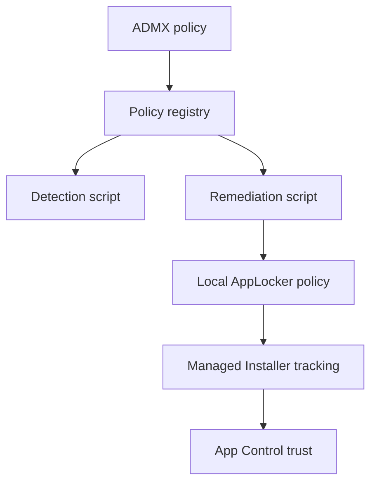

# Architecture

The toolkit separates configuration intent from policy enforcement.



## ADMX layer

The ADMX writes machine-scoped values below:

```text
HKLM\Software\Policies\ManagedInstallers
```

It contains a global three-state setting, preset enablement and optional overrides, and twenty custom publisher-rule slots. It doesn't contain preset signer metadata.

## Preset catalog

Preset IDs, publisher names, product names, binary names, and recommended minimum versions are embedded in both PowerShell scripts. This keeps detection and remediation self-contained and lets administrators update defaults without reimporting the ADMX.

## Detection

Detection reads the desired registry configuration, resolves presets and custom slots into desired publisher rules, and compares them against the effective AppLocker policy. It also checks required services and the compiled Managed Installer policy binary.

Exit codes:

- `0`: compliant or intentionally not configured;
- `1`: remediation required or configuration invalid.

## Remediation

Remediation reads the local AppLocker policy, removes only toolkit-owned rules, preserves unrelated local rules, and merges the desired policy. It starts Managed Installer tracking with `appidtel.exe start -mionly` and verifies that the desired rules appear in the effective policy.

## Ownership

Rules are considered toolkit-owned when they use:

- a fixed preset GUID;
- a fixed infrastructure-rule GUID;
- a description beginning with `ManagedInstallers:`;
- the legacy `SolidoMI:` marker used by the pre-public V8 script.

Custom rule GUIDs are deterministically derived from slot numbers. Changing the contents of Custom Managed Installer 03 therefore updates the same logical slot.

## Important limitation

`Set-AppLockerPolicy -Merge` can add rules but doesn't remove rules omitted from a new fragment. The remediation first reconciles the complete local policy to remove owned rules, then merges the desired fragment. Test this behavior with every other source of AppLocker policy used in your environment.
