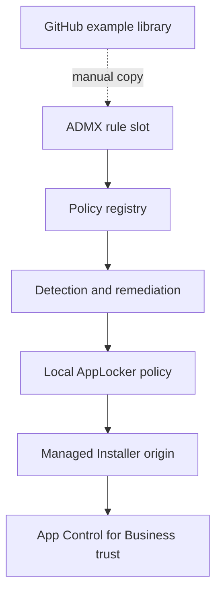

# Architecture

The toolkit separates configuration intent from enforcement and has a strict scope boundary: it manages the AppLocker Managed Installer configuration used by App Control for Business. The App Control for Business policies themselves remain outside the toolkit.

The dotted connection is intentionally manual. Endpoints never download library data.

## ADMX layer

The ADMX writes twenty machine-scoped rule slots below `HKLM\Software\Policies\ManagedInstallers\Rules`. There is no separate global switch. Each slot holds Enabled, Name, Publisher, Product, Binary, and MinimumVersion.

## Detection

Detection validates enabled rule slots, derives a stable GUID from each slot number, compares the full publisher condition with effective AppLocker policy, identifies stale toolkit-owned rules, checks required services, and verifies the compiled Managed Installer policy binary.

Exit code `0` means compliant or intentionally not configured; `1` requests remediation or reports invalid configuration.

## Remediation

Remediation removes toolkit-owned local rules, preserves unrelated local rules, builds the desired publisher rules from enabled slots, starts Managed Installer tracking, captures the existing compiled-policy timestamp, merges the enabled Managed Installer collection, waits for the compiled policy to be created or updated, and verifies the effective mode and rule IDs. With configured but Disabled slots it performs cleanup without starting tracking.

## Ownership and migration

Rules have descriptions beginning with `ManagedInstallers:` and deterministic slot GUIDs. The two infrastructure rules have fixed IDs so the toolkit can reconcile only the policy objects it owns.

## Important limitation

`Set-AppLockerPolicy -Merge` does not remove omitted rules. Remediation therefore reconciles the complete local policy before merging the desired fragment. Test coexistence with every other AppLocker policy source in your environment.
