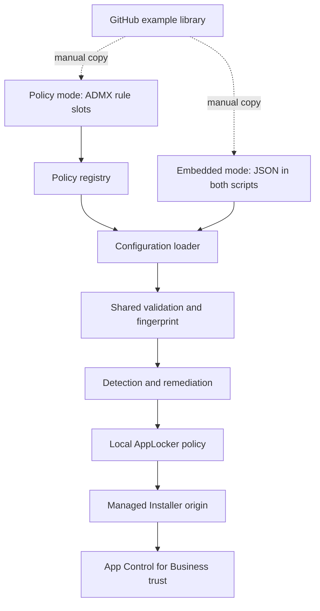

# Architecture

The toolkit separates configuration intent from enforcement and has a strict scope boundary: it manages the AppLocker Managed Installer configuration used by App Control for Business. The App Control for Business policies themselves remain outside the toolkit.

The dotted connection is intentionally manual. Endpoints never download library data.

## ADMX layer

The ADMX writes twenty machine-scoped rule slots below `HKLM\Software\Policies\ManagedInstallers\Rules`. There is no separate global switch. Each slot holds Enabled, Name, Publisher, Product, Binary, and MinimumVersion.

## Embedded layer

Embedded mode reads an administrator-maintained JSON array from each script and doesn't use the ADMX-backed registry. Both scripts must contain the same mode, JSON, and configuration version. A normalized SHA-256 fingerprint is reported so operators can compare the two configurations in Intune output.

## Detection

Detection loads the explicitly selected configuration source, validates its rules, derives a stable GUID from each slot number, compares the full publisher condition with effective AppLocker policy, identifies every additional or stale Managed Installer rule, checks required services, and verifies the compiled Managed Installer policy binary.

Exit code `0` means the configured intent is compliant. When the selected source intentionally contains no rules, detection also verifies that no reconciled rules remain. Exit code `1` requests remediation or reports invalid configuration.

## Remediation

Remediation first checks whether the complete desired state is already compliant and exits without writing when no changes are required. Otherwise it removes the complete local Managed Installer collection plus toolkit infrastructure rules, preserves unrelated rules in other AppLocker collections, builds the desired publisher rules from the selected source, starts Managed Installer tracking, captures the existing compiled-policy timestamp, merges the enabled Managed Installer collection, waits for the compiled policy to be created or updated, and verifies the effective mode and rule IDs. It skips the local-policy write when there are no Managed Installer or toolkit infrastructure rules to remove.

## Ownership and migration

The selected configuration source is authoritative for the entire Managed Installer collection. All pre-existing Managed Installer rules—including rules created by earlier scripts or another local configuration—are removed during reconciliation. Rules in other AppLocker collections remain outside this exclusive scope, except for the two fixed-ID EXE/DLL infrastructure rules required by the toolkit.

## Important limitation

`Set-AppLockerPolicy -Merge` does not remove omitted rules. Remediation therefore removes the local Managed Installer collection before merging the desired fragment. If Group Policy, MDM, or another source contributes additional effective Managed Installer rules, detection remains noncompliant and remediation reports the conflict. Test coexistence with every other AppLocker policy source in your environment.
